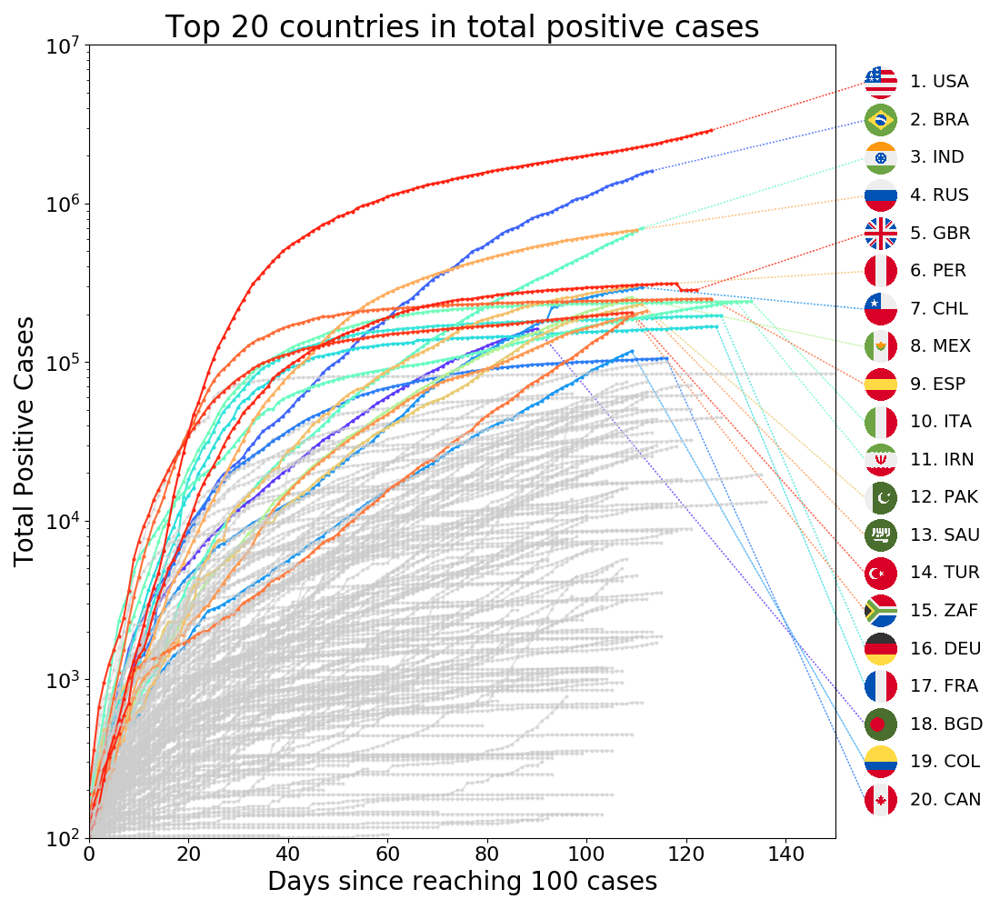
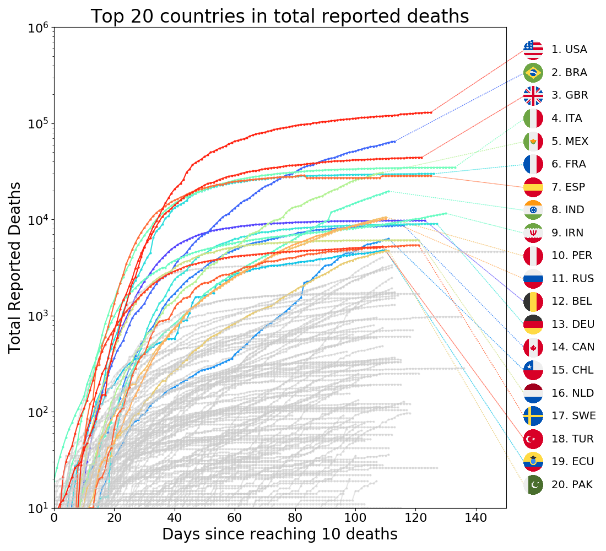
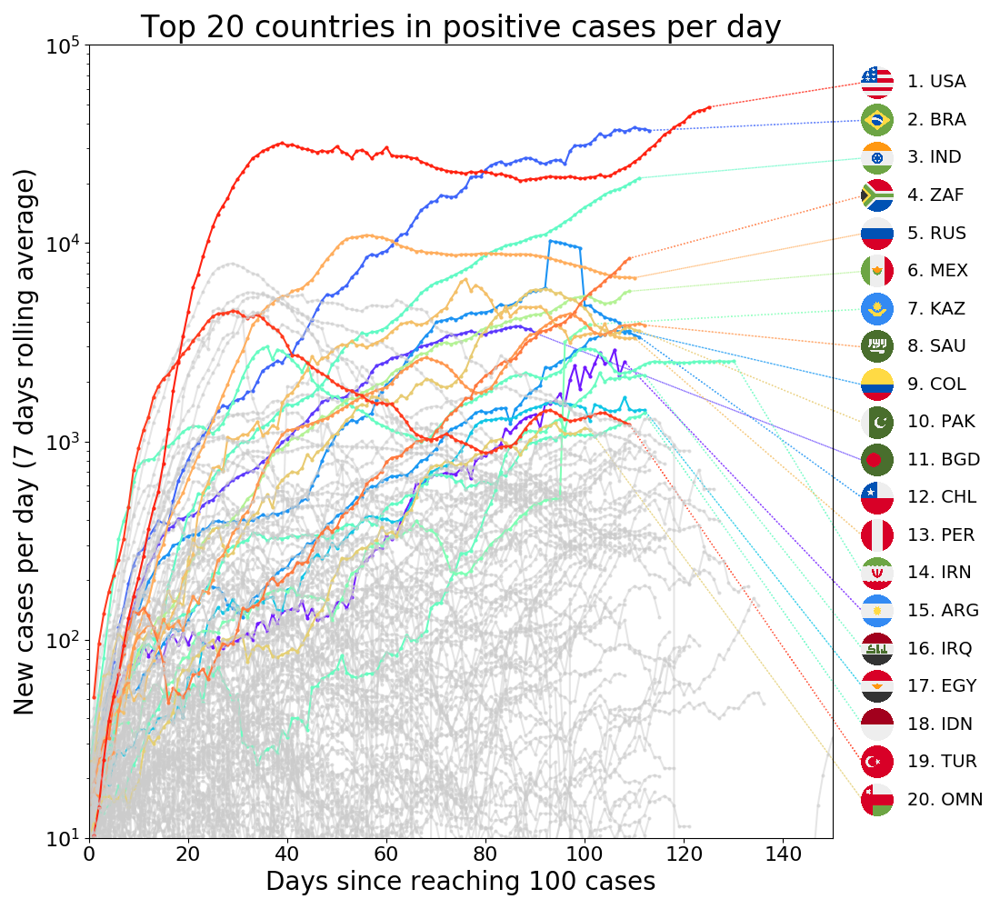
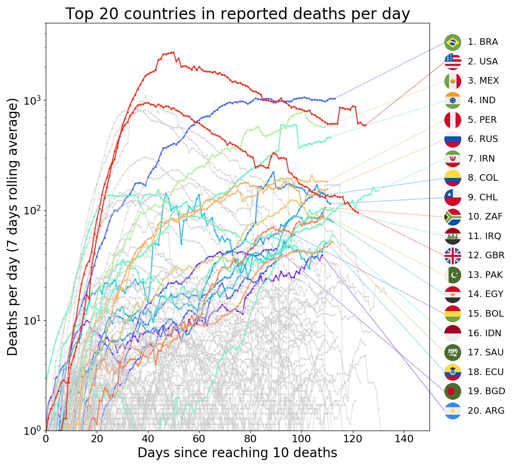
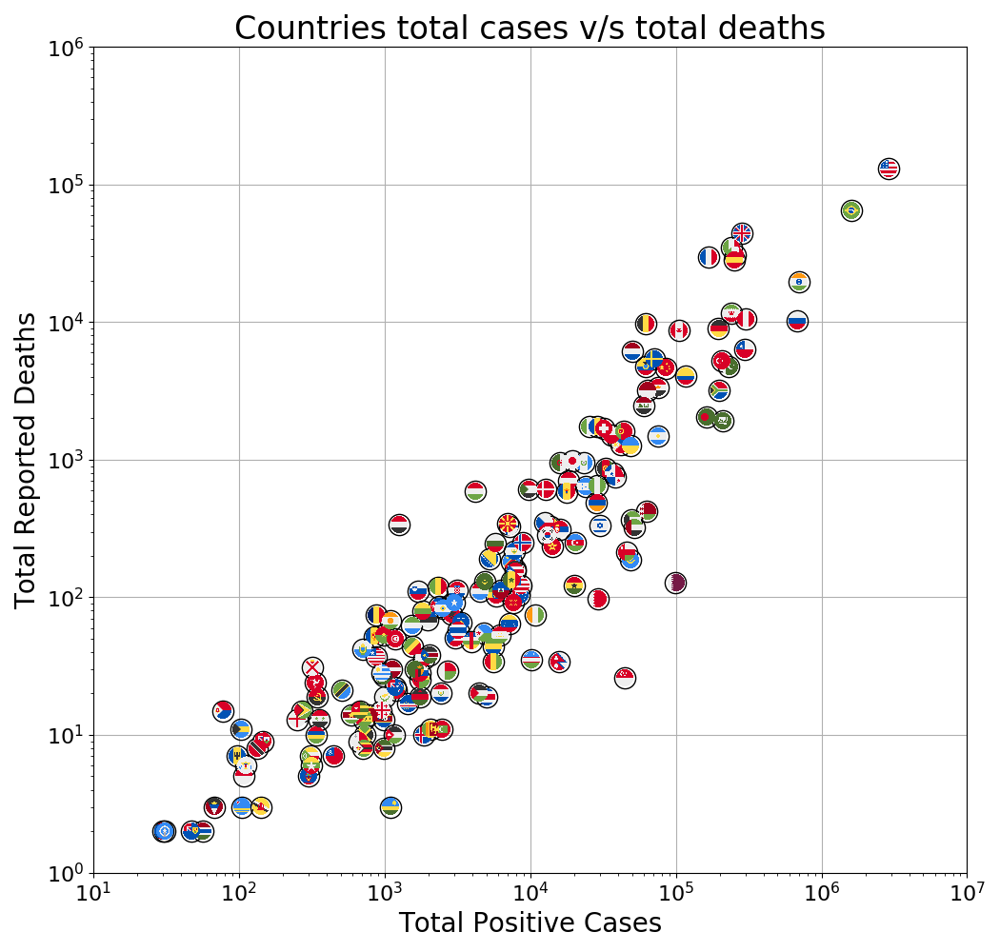
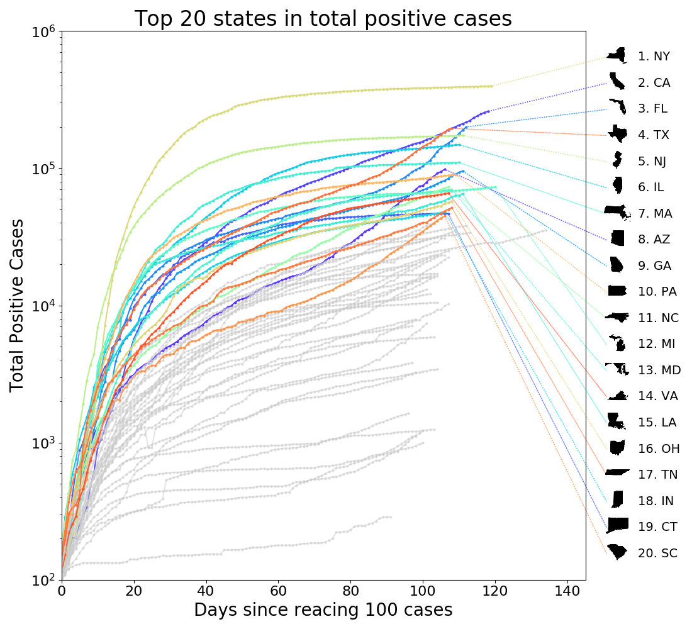
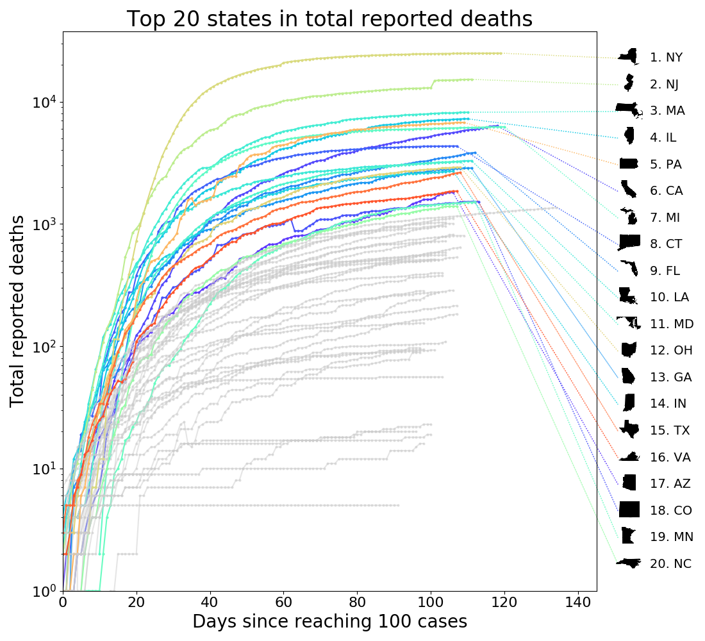
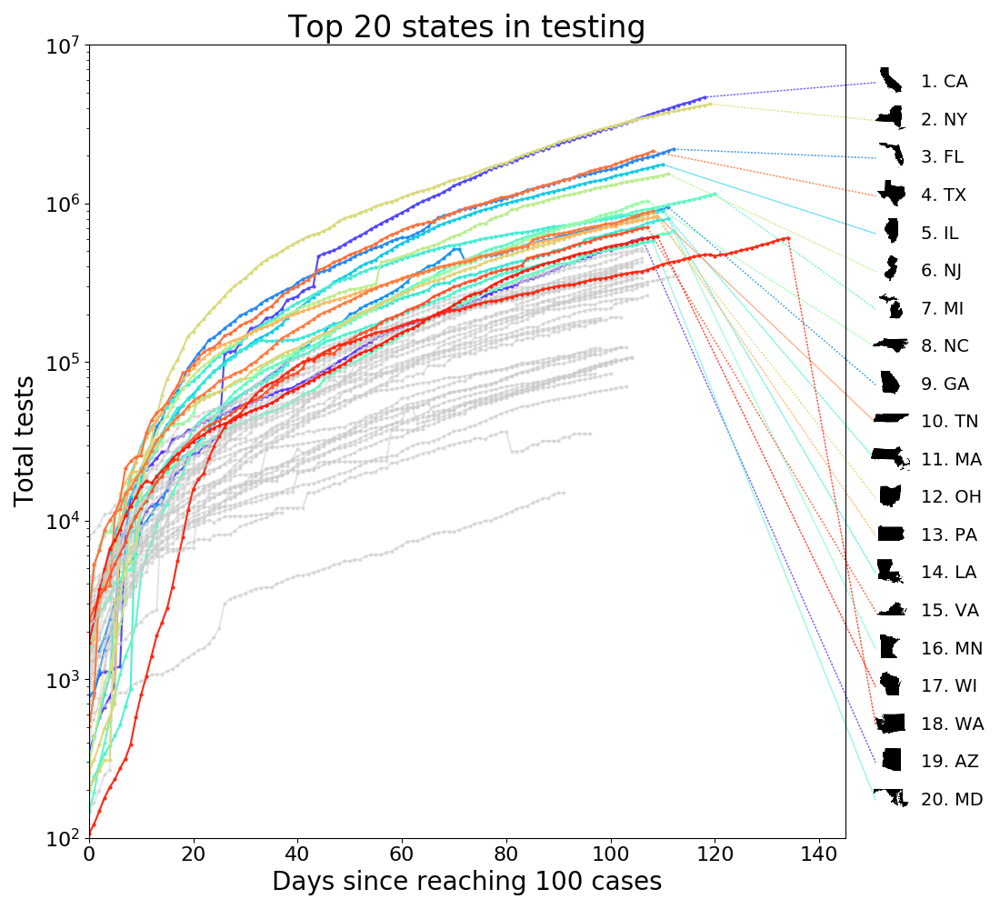
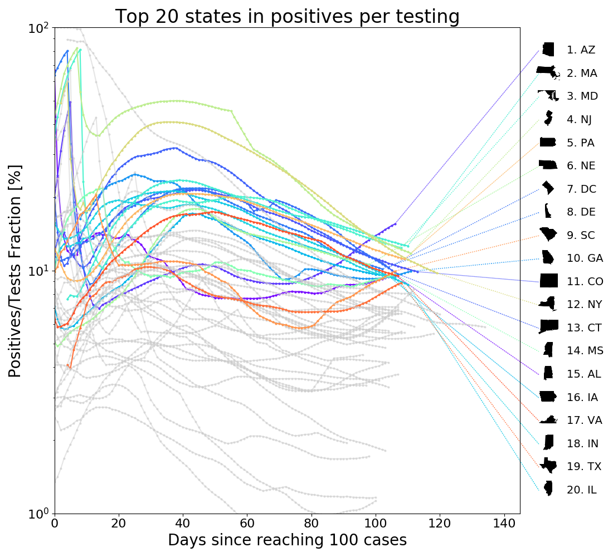

# Overview

This is a collection of resources, visualizations, and analysis
regarding the Covid-19 pandemic. For now it includes some graphical
representations, and an example on how to use Gaussian Process to infer
the time rates (in making).

My goal is to eventually correlate the dynamics of individual countries
and US' states with their respective responses, as well as some
socio-economic metrics.

## TOC

* [Countries](#Countries)
* [USA by state](#USA-by-state)
* [Data sources on Covid19](#Data-sources-on-Covid19)
* [Interesting analysis and commentaries on Covid19](#Interesting-analysis-and-commentaries-on-Covid19)

## Countries

Here are the top countries in number of cases and deaths as of 06-JUL-2020.

Data taken from the [European CDC](https://opendata.ecdc.europa.eu/covid19/casedistribution/csv). 
Country flags taken from [HatScripts](https://github.com/HatScripts/circle-flags). 
Scripts: [update_alldata.sh](data/update_alldata.sh), [countries_eda.py](src/countries_eda.py).

## USA by state

Here are the top states within USA in number of cases, testing, and deaths as of 24-JUN-2020.

Data taken from [covidtracking](https://covidtracking.com/).
State's geographical shape icons taken from [coryetzkorn](https://github.com/coryetzkorn/state-svg-defs). 
Scripts: [update_alldata.sh](data/update_alldata.sh), [usa_states_eda.py](src/usa_states_eda.py).

## Data sources on Covid19
* Covid19 data by country compiled by the European Centre for Disease Prevention and Control [ecdc-covid-19-cases-worldwide](https://www.ecdc.europa.eu/en/geographical-distribution-2019-ncov-cases)
* Testing data sources compiled by OurWorldInData [github/owid/covid-19-data](https://github.com/owid/covid-19-data/tree/master/public/data/testing)
* Johns Hopkins CSSE repo [github/Johns-Hopkins/COVID-19](https://github.com/CSSEGISandData/COVID-19)
* Covid19 data from the US by state. It includes number of tests. [covidtracking](https://covidtracking.com/)
* Covid19 data from the US by state and county. Does not include number of tests. [github/nytimes/covid-19-data](https://github.com/nytimes/covid-19-data)
* Covid19 data from the US by state by race. [covidtracking/race](https://covidtracking.com/race)
* Covid19 data from the US on prisons. [github/themarshallproject/COVID_prison](https://github.com/themarshallproject/COVID_prison_data)
* Covid data from France [github/opencovid19-fr](https://github.com/opencovid19-fr/data)
* Hospital covid data from France [donnees-hospitalieres-relatives-a-lepidemie-de-covid-19](https://www.data.gouv.fr/fr/datasets/donnees-hospitalieres-relatives-a-lepidemie-de-covid-19/)
* Covid19 data from Germany [github/covid-19-germany-gae](https://github.com/jgehrcke/covid-19-germany-gae)
* Covid19 data from Spain [github/datadista/COVID 2019](https://github.com/datadista/datasets/tree/master/COVID%2019)
* Covid19 data for Lating America [github/covid_latinoamerica](https://github.com/DataScienceResearchPeru/covid-19_latinoamerica)
* "COVID-19 Economic Stimulus Index" [paper](http://web.boun.edu.tr/elgin/COVID_19.pdf), [website](http://web.boun.edu.tr/elgin/COVID.htm), [data](COVID-19 Economic Stimulus Index)
* Oxford is tracking goverment responses and the number of covid cases. [oxford-covid-19-government-response-tracker](https://www.bsg.ox.ac.uk/research/research-projects/oxford-covid-19-government-response-tracker)
* Data from The Economist on tracking the actual v/s expected number of deaths [github/TheEconomist/excess-deaths](https://github.com/TheEconomist/covid-19-excess-deaths-tracker)
* Similar kind of data from the NY Times [github/nytimes/excess-deaths](https://github.com/nytimes/covid-19-data/tree/master/excess-deaths)
* Short-term Mortality Fluctuations (STMF) dataset by The Human Mortality Database [data](https://www.mortality.org/Public/STMF/Outputs/stmf.csv) [notes](https://www.mortality.org/Public/STMF_DOC/STMFNote.pdf) [website](https://www.mortality.org/)

## Interesting analysis and commentaries on Covid19
* Genomic epidemiology of covid19 [nextstrain/ncov](https://nextstrain.org/ncov)
* Analysis by OurWorldInData. Good charts and discussions. [ourworldindata/coronavirus](https://ourworldindata.org/coronavirus)
* Performance evaluation of models submited to Forecast Hub [covid19-forecast-hub-evaluation](https://github.com/youyanggu/covid19-forecast-hub-evaluation)
* Preliminary assessment of CDC data reporting by May 18th (US) [covidtracking-CDC-report](https://covidtracking.com/documents/CDC%20Data%20Report%20%20-%20The%20COVID%20Tracking%20Project.pdf) 
* List of Collaborative projects on Covid19 data [Call-for-action](https://docs.google.com/document/d/1JWeD1AaIGKMPry_EN8GjIqwX4J4KLQIAqP09exZ-ENI/edit?mkt_tok=eyJpIjoiT0RRd1lqZzVaREF4WVdSbSIsInQiOiJWODlWM0k3dktTbXg0R1ZWbUxpZHlYSEdvalN4WjJcL0llZ0VoV29Veml4XC9PQldKMzN4eUVESzR0QUUzUGwydDhDaFZLKzFPRkR6ajBZNG8yVXRuN01uU0Nqemc4TVJUZERUZ1NQYkV5REs3ZjE2Zm5mZE9BTmtPWEVTd2xhM0RCIn0%3D#)
* Collection of tableau graphics [tableau-data-resources](https://www.tableau.com/covid-19-coronavirus-data-resources)
* Collection of different statistical analysis and visualizations [covid19dashboards](https://covid19dashboards.com/)
* Paper "How Did COVID-19 and Stabilization Policies Affect Spending and Employment? A New Real-Time Economic Tracker Based on Private Sector Data" [github/EconomicTracker](https://github.com/Opportunitylab/EconomicTracker)
* Graphics on "excess deaths" in about European countries [euromomo](https://www.euromomo.eu/graphs-and-maps)
* The paper that changed the mind of the UK goverment on how to handle the virus. Historically relevant
  [Imperial-College-COVID19-NPI-modelling](https://www.imperial.ac.uk/media/imperial-college/medicine/sph/ide/gida-fellowships/Imperial-College-COVID19-NPI-modelling-16-03-2020.pdf)
* Working paper on "Misinformation During a Pandemic" [bfi.uchicago.edu/Misinformation-paper](https://bfi.uchicago.edu/working-paper/2020-44/)
* Article on what is the "good" attitude one should have when doing data science on covid19 [rexdouglass/How_To_Be_Curious_Instead_of_Contrarian_About_Covid19](https://rexdouglass.github.io/TIGR/Douglass_2020_How_To_Be_Curious_Instead_of_Contrarian_About_Covid19.nb.html)
* Article about how making all models relative is potentially dangerous to public opinion. Some are worst than others. Lessons learned from the discourse on climate change. [rssdss/all-models-are-wrong-but-some-are-completely-wrong](https://rssdss.design.blog/2020/03/31/all-models-are-wrong-but-some-are-completely-wrong/)
* Article discussing some of the difficulties in modeling the infection, mostly on how data is constructed and hidden variables [fivethirtyeight/why-its-so-freaking-hard-to-make-a-good-covid-19-model](https://fivethirtyeight.com/features/why-its-so-freaking-hard-to-make-a-good-covid-19-model/)
* Article on the meaning of positive cases, and some other ways to estimate the actual number of cases [fivethirtyeight/coronavirus-case-counts-are-meaningless](https://fivethirtyeight.com/features/coronavirus-case-counts-are-meaningless/)
* Medium article with an interesting preliminary analysis from concerned people [medium/tomaspueyo/the-hammer-and-the-dance](https://medium.com/@tomaspueyo/coronavirus-the-hammer-and-the-dance-be9337092b56)
* Interesting article about how changes in behavior during the pandemic have caused challenges to AI models. [technologyreview-AI-covid-change](https://www.technologyreview.com/2020/05/11/1001563/covid-pandemic-broken-ai-machine-learning-amazon-retail-fraud-humans-in-the-loop/)

