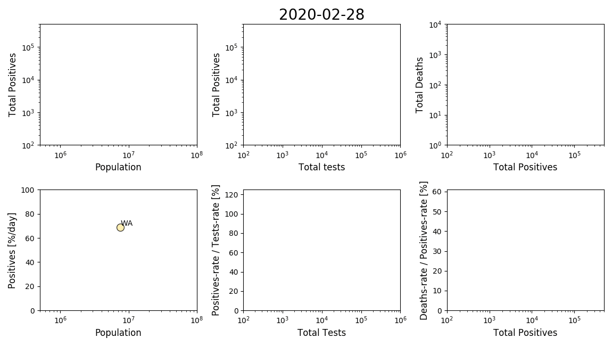

## TOC

* [Approach](#Approach)
* [Preliminary analysis](#preliminary-analysis)
  * [Relative rates: positives/tests & deaths/positives](#relative-rates-positivestests--deathspositives)
  * [Growth-rates with respect to time](#growth-rates-with-respect-to-time)
* [Directions](#directions)

## Approach

The goal is to infer derivatives in the variables related to covid-19,
for which I used the
[fitderiv](http://swainlab.bio.ed.ac.uk/software/fitderiv/) package
implementing Gaussian process regression:
* For derivatives of the positives cases relative to people testes, as
well as deaths relative to positive cases, the variables were kept
without transforming them.
* For the derivatives with respect to time, the log of values were used
resulting in inferring the exponential rate constant (or
growth-rate). We expect that the number of infected people (some
function of positive cases) should follow an exponential growth. However
it is less clear what relation we should expect for the growth of
testing (somewhat arbitrary process) and deaths (may depend on the
fraction of risk-population and health-care capacity).  

**NOTE:** The errors are the 95% confidence intervals assuming Gaussian
distributions and covariance with default parameters. Some of the curves
present steep transitions and were not able to converge properly during
optimization. I am unsure at the moment how best to handle these cases.

### TODO

* Figure out how to deal with steep transitions, especially for the
  total number of tests. Clearly there are some delays in the reporting
  and different practices state by state. How is testing decided and how
  they is reported/collected?
* We are inferring directly on the instant relative rates. This will be
  biased in case there are any delays (e.g. positive cases and deaths).

## Preliminary analysis

* Overall we can appreciate a reduction in the posive cases growth-rate,
most likely as a result of the measures taken. 
* From the other rates I am not entirely sure we can conclude. 
  * One challenge is that the data for "total number of tests" appear to
  be quite state-dependent and has these steep transitions.
  * Another challenge is with regards to the rate
  deaths/positives. Doing instantaneous deaths/positives as I have done
  here is clearly wrong because of delays. Should we assume a fixed
  delay? Or find the delay that minimizes the variance in
  deaths/positives rates? The second approach sounds interesting if we
  can "safely" assume that the health-care capacity and fraction of
  risk-population infected is constant over-time. (... or fit to a
  proper dynamical model).

### Relative rates: positives/tests & deaths/positives

Animation:

	
<b>Click to see the animation</b>

	

Each point represents a state, and the colors are by the total number of
reported deaths (from white to dark red). For plotting NaN values were
set to 0 just for visualization. 

For more details we plot the trajectory of the variables and the
estimated growth-rates. States are clustered within similar total
population range.

**California, Texas, Florida, New York, & Pennsylvania**

	
<b>Click to expand and see similar plots for the rest of the states</b>

	

**Illinois, Ohio, Georgia, North Carolina, & Michigan**

**New Jersey, Virginia, Washington, Arizona, & Massachusetts**

**Tennessee, Indiana, Missouri, Maryland, Wisconsin**

**Colorado, Minnesota, South Carolina, Alabama, & Louisiana**

**Kentucky, Oregon, Oklahoma, Connecticut, & Utah**

**Iowa, Nevada, Arkansas, Mississippi, & Kansas**

**New Mexico, Nebraska, West Virginia, Idaho, & Hawaii**

**New Hampshire, Maine, Montana, Rhode Island, & Delaware**

**South Dakota, North Dakota, Alaska, District of Columbia, Vermont, & Wyoming**

**American Samoa, Guam, Northern Mariana Islands, Puerto Rico, & Virgin Islands**

### Growth-rates with respect to time 

Animation:

	
<b>Click to see the animation</b>

	

Each point represents a state, and the colors are by the total number of
reported deaths (from white to dark red). For plotting NaN values were
set to 0 just for visualization. 

For more details we plot the trajectory of the variables and the
estimated growth-rates. States are clustered within similar total
population range.

**California, Texas, Florida, New York, & Pennsylvania**

	
<b>Click to expand and see similar plots for the rest of the states</b>

	

**Illinois, Ohio, Georgia, North Carolina, & Michigan**

**New Jersey, Virginia, Washington, Arizona, & Massachusetts**

**Tennessee, Indiana, Missouri, Maryland, Wisconsin**

**Colorado, Minnesota, South Carolina, Alabama, & Louisiana**

**Kentucky, Oregon, Oklahoma, Connecticut, & Utah**

**Iowa, Nevada, Arkansas, Mississippi, & Kansas**

**New Mexico, Nebraska, West Virginia, Idaho, & Hawaii**

**New Hampshire, Maine, Montana, Rhode Island, & Delaware**

**South Dakota, North Dakota, Alaska, District of Columbia, Vermont, & Wyoming**

**American Samoa, Guam, Northern Mariana Islands, Puerto Rico, & Virgin Islands**

## Directions

Directions:
* Obtain data regarding date and degree of isolation measures and
  overlay this with the rates.
* Obtain data regarding state metrics such as health index, population
  density, age distributions, etc and correlate with these estimation. I
  think would be most meaningful with the data after a few more months.
