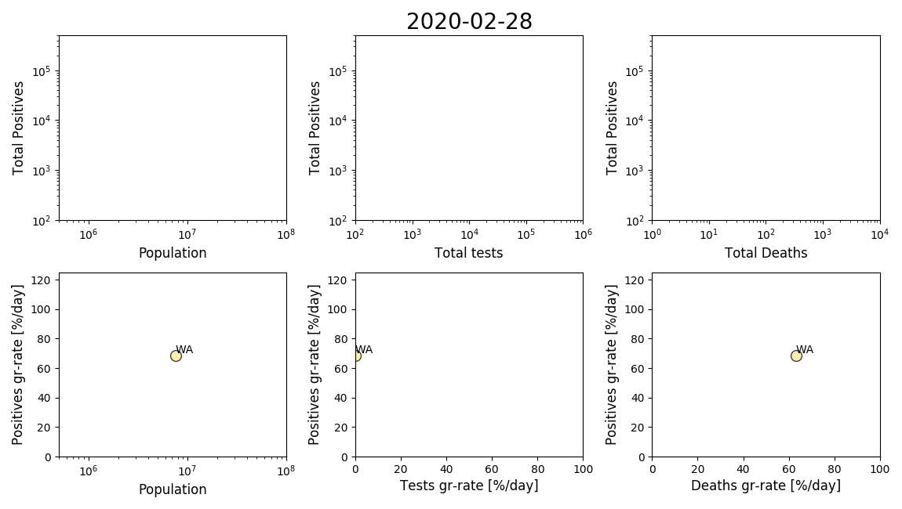

## TOC

* [Approach](#Approach)
* [Preliminary analysis](#preliminary-analysis)
  * [Growth-rates with respect to time](#growth-rates-with-respect-to-time)
  * [Relative rates: positives/tests & deaths/positives](#relative-rates-positivestests--deathspositives)
* [Directions and TODOs](#directions-and-todos)

## Approach

As the number of infected people should follow some king of exponential
function, I used the
[fitderiv](http://swainlab.bio.ed.ac.uk/software/fitderiv/) package for
inferring the derivative of the log of the data (growth-rate). I also
present infer the growth-rate for the total number of test and deaths,
although I have no reason to expect them to follow an exponential
function (perhaps deaths?). NOTE: errors on the log-rates are likely to
be underestimated.

## Preliminary analysis

* Overall we can appreciate a reduction in the posive cases growth-rate,
most likely as a result of the measures taken. 
* Are the total tests gr-rates and the positives gr-rates correlated? It
  appears so in some cases. But how is testing decided and how they is
  reported/collected? Also should account for likely delays in reporting
  or collection.
* Death rates seem to decrease or remain relatively flat. Hard to say if
  "sharp" transitions observed are due to low numbers (just random), or
  details on how the data was reported/collected. We should wait for a
  few more weeks.

### Growth-rates with respect to time 

It is easy to see how overall rates begin to decrease from the second
half of March. Animation:

	
<b>Click to see the animation</b>

	

Each point represents a state, and the colors are by the total number of
reported deaths (from white to dark red). For plotting NaN values were
set to 0 just for visualization. 

For more details we plot the trajectory of the variables and the
estimated growth-rates. States are clustered within similar total
population range.

**California, Texas, Florida, New York, & Pennsylvania**

	
<b>Click to expand and see similar plots for the rest of the states</b>

	

**Illinois, Ohio, Georgia, North Carolina, & Michigan**

**New Jersey, Virginia, Washington, Arizona, & Massachusetts**

**Tennessee, Indiana, Missouri, Maryland, Wisconsin**

**Colorado, Minnesota, South Carolina, Alabama, & Louisiana**

**Kentucky, Oregon, Oklahoma, Connecticut, & Utah**

**Iowa, Nevada, Arkansas, Mississippi, & Kansas**

**New Mexico, Nebraska, West Virginia, Idaho, & Hawaii**

**New Hampshire, Maine, Montana, Rhode Island, & Delaware**

**South Dakota, North Dakota, Alaska, District of Columbia, Vermont, & Wyoming**

**American Samoa, Guam, Northern Mariana Islands, Puerto Rico, & Virgin Islands**

### Relative rates: positives/tests & deaths/positives

## Directions and TODOs

TODO:
* Do some sweeping on hyper-parameters and see if we can get more
  reasonable estimations of the errors? Q: what measure of "reasonable"
  should we use?

Directions:
* Obtain data regarding date and degree of isolation measures and
  overlay this with the rates.
* Obtain data regarding state metrics such as health index, population
  density, age distributions, etc and correlate with these estimation. I
  think would be most meaningful with the data after a few more months.
